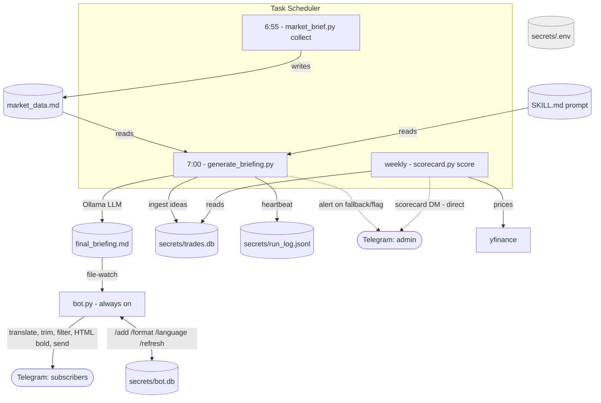

# Daily Market Agent — Runtime Architecture

A boxes-and-arrows view of **what runs when, who writes which file, who reads it,
and who sends to Telegram.** If you only remember one thing, make it the
"Two delivery paths" section.

---

## TL;DR — the two things that confuse people

1. **There is no single "app."** It's several short scripts plus one always-on
   process, coordinated through **files on disk** (not direct calls). One script
   writes a file; another notices and acts. That's the whole trick.

2. **Two different ways things reach Telegram:**
   - **Via `bot.py`** — only the daily briefing. `generate_briefing` writes
     `final_briefing.md`; `bot.py` is watching that file and forwards it.
   - **Direct send** — the scorecard and the health alerts call the Telegram API
     themselves. `bot.py` is *not involved* and does *not* need to be running.

---

## The daily pipeline (ASCII)

```
                 secrets/.env  ──(loaded by core.py; every script imports core)──┐
                                                                                  │
  TASK SCHEDULER                                                       ALWAYS-ON  │
  ──────────────                                                       ─────────  │
                                                                                  │
  6:55am  market_brief.py collect                                                 │
            │  fetches: yfinance · FMP · FRED · Tradier · RSS (Yahoo/WSJ/Reddit)  │
            ▼                                                                      │
        market_data.md ───────────────┐                                          │
                                       │ reads                                    │
  7:00am  generate_briefing.py ◄───────┘                                          │
            │  reads SKILL.md (the prompt) + market_data.md                       │
            │  → Ollama (local LLM)                                               │
            ▼                                                                      │
        final_briefing.md ──────────────────────────►  bot.py  (runs 24/7)        │
            │                                             │  watches final_briefing.md
            │  ON SUCCESS, also:                          │  on change, FOR EACH subscriber:
            ├─► validate trade levels                     │    1. translate   (their /language)
            ├─► secrets/run_log.jsonl   (heartbeat)       │    2. trim short   (their /format)
            ├─► secrets/trades.db       (log ideas)       │    3. filter to their watchlist
            └─► DM admin IF fallback/flagged ──┐          │    4. add HTML bold, send
                                               │          ▼
                                               │     Telegram SUBSCRIBERS
                                               │
                                               │     bot.py also handles INBOUND:
                                               │     /add /remove /watchlist /refresh
                                               │     /language /format /start /stop
                                               │          │
                                               │          ▼
                                               │     secrets/bot.db (subscribers, watchlists, prefs)
                                               │
  weekly  scorecard.py score                   │
            │  reads secrets/trades.db          │
            │  grades outcomes via yfinance      │
            └─► DM admin (the scorecard) ───────┴──►  Telegram ADMIN only
                  ▲ sends DIRECTLY — bot.py NOT involved, need not be running
```

---

## Same thing as a Mermaid diagram (renders on GitHub / VS Code)



---

## Processes — what runs, when, what it needs

| Process | How it runs | Needs | Produces |
|---|---|---|---|
| `market_brief.py collect` | Scheduler, 6:55am | internet (data APIs), `.env` | `market_data.md` |
| `generate_briefing.py` | Scheduler, 7:00am | `market_data.md`, `SKILL.md`, **Ollama up** | `final_briefing.md`, heartbeat, ingested ideas; admin alert on failure |
| `bot.py` | **Always-on** (NSSM / "at log on") | `.env`, internet | forwards briefs; edits `bot.db` from commands |
| `scorecard.py score` | Scheduler, **weekly** | `.env`, internet (yfinance) — **no Ollama, no bot.py** | grades `trades.db`; DMs admin |
| `market_brief.py send FILE` | manual | `.env` | one-off Telegram send |

> Note: `market_brief.py` with **no argument** (`main()`) is a *separate, older*
> path that broadcasts the raw dashboards directly. The live product uses
> `collect → generate_briefing → bot.py`. Don't confuse the two.

---

## Files — who writes, who reads (this IS the coordination)

| File | Written by | Read by | Committed to git? |
|---|---|---|---|
| `market_data.md` | `collect` | `generate_briefing` | No (gitignored — it's output) |
| `final_briefing.md` | `generate_briefing` | `bot.py` | No (gitignored) |
| `.last_sent` | `bot.py` | `bot.py` (don't re-send same brief) | No |
| `secrets/bot.db` | `bot.py`, `db.py` | both | No (under `secrets/`) |
| `secrets/trades.db` | `generate_briefing` (ingest), `scorecard` | `scorecard` | No |
| `secrets/run_log.jsonl` | `generate_briefing` | you (debugging) | No |
| `options_history.json` | `collect` | `collect` (unusual-volume baseline) | No |
| `SKILL.md` | **you** (the prompt) | `generate_briefing` | Yes (source) |
| `secrets/.env` | **you** (secrets) | `core.py` → everyone | No (never commit) |

---

## The two delivery paths (the part you asked about)

```
PATH A — the daily brief                 PATH B — scorecard + health alerts
────────────────────────                 ──────────────────────────────────
generate_briefing.py                     scorecard.py score   (or generate_briefing alerts)
   writes final_briefing.md                  │
        │                                     │ calls core.send_telegram() directly
        ▼                                     │ (a plain HTTPS POST with BOT_TOKEN)
   bot.py sees the file change                ▼
        │                                  Telegram (admin only)
        ▼
   Telegram subscribers
```

- Path A **requires `bot.py` running**; it's the file-watcher/forwarder.
- Path B **does not** touch `bot.py` and doesn't care if it's running. It sends
  itself, immediately, when the script runs. Sending is stateless — multiple
  scripts can post to the Telegram API at once with no conflict.

> **`/refresh` (on-demand, per-user):** a subscriber can rebuild *their own* brief
> intraday. `bot.py` runs `market_brief.build_market_data` + `generate_briefing.build_briefing_text`
> entirely **in memory** on a background thread and sends the result **only to that
> chat** — it deliberately does NOT write `market_data.md` / `final_briefing.md`, so
> the file watcher never broadcasts it to everyone. Guarded by a single-run lock and a
> per-user cooldown (admin exempt).

---

## Mental-model checklist (use this to reason about any change)

- Which **process** does this change live in? (collect / generate / bot / scorecard)
- Does it **write a file** something else watches, or **send to Telegram directly**?
- Does it need **Ollama** (only `generate_briefing` does) or just **internet**?
- Is the data it needs **already on disk** (a prior step wrote it) or must it fetch?
- If it sends to users, it goes through **`bot.py` + `final_briefing.md`**.
  If it sends to just the admin, it's a **direct `send_telegram`**.

---

## Scheduler timeline (a normal weekday)

```
06:55  collect            → market_data.md
07:00  generate_briefing  → final_briefing.md (+ ingest ideas + heartbeat)
07:00..  bot.py (always on) notices final_briefing.md within ~25s → fans out to subscribers
(Fri ~07:10)  scorecard score → grades the week, DMs you the scorecard
```
